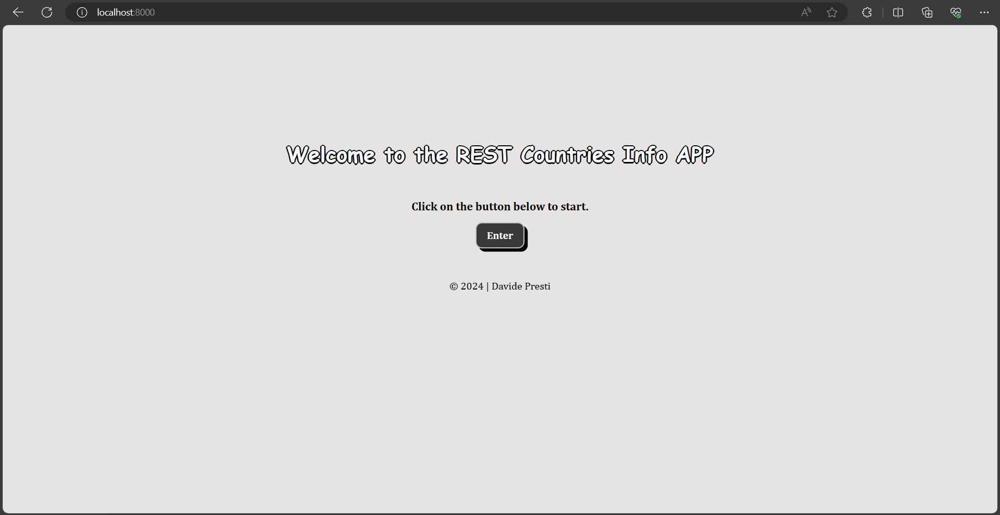
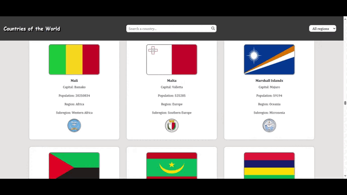

# Rest Countries Info APP [](https://opensource.org/licenses/MIT)  


## - Introduzione -

**Rest Countries Info APP** è un piccolo progetto costruito con Django che utilizza la [API di REST Countries](https://restcountries.com/) e la [API di Wikipedia](https://www.mediawiki.org/wiki/API:Main_page) per visualizzare le informazioni dettagliate dei paesi del mondo. Questo progetto è stato fatto con Python 3.12, JavaScript, Bootstrap 5, HTML5 e CSS3. È il primo progetto che carico su GitHub e il primo in assoluto che ho sviluppato con Django, quindi protrebbero esserci degli errori, pertanto qualsiasi contributo o consiglio è ben accetto.

## - Requisiti -

Assicurati di avere Python installato nel tuo sistema, per verificarlo apri la riga di comando ed esegui questo comando:

```bash
    py --version # Windows
    python --version # Unix/macOS
```

Se non hai Python installato visita https://www.python.org/downloads/ e scarica l'ultima versione.

## - Installazione -

1. Clona la repository:

```bash
    git clone https://github.com/DavidePresti/rest-countries-django-app.git
```

2. Entra nella cartella della repository:

```bash
    cd rest-countries-django-app
```
3. Crea un ambiente virtuale:

```bash
    py -m venv venv # Windows
    python -m venv venv # Unix/macOS
```

4. Attiva l'ambiente virtuale:

```bash
    venv/Scripts/activate.bat # Windows
    source venv/bin/activate # Unix/macOS
```

5. Entra nella cartella del progetto:

```bash
    cd myproject
```

6. Installa i pacchetti necessari:

```bash
    py -m pip install -r requirements.txt # Windows
    python -m pip install -r requirements.txt # Unix/macOS
```

7. Genera una chiave segreta casuale e salvala in un file .env: <br/>
 (Questa app non utilizza un metodo di autenticazione e non immagazzina dati sensibili, ma in ogni caso è sempre meglio creare una chiave segreta e salvarla in una variabile d'ambiente).

```bash
    # PASSO 1: Apri la Shell di Python nel terminale.

    py manage.py shell # Windows
    python manage.py shell # Unix/macOS
```

```bash
    # PASSO 2: Importa la funzione get_random_secret_key().

    from django.core.management.utils import get_random_secret_key
```

```bash
    # PASSO 3: Genera la chiave segreta con la funzione get_random_secret_key().

    print(get_random_secret_key())
    # Copia la chiave.
```

```bash
    # PASSO 4: Chiudi la Shell di Python.

    exit()
```

```bash
    # PASSO 5: Crea il file .env con la variabile d'ambiente "SECRET KEY" e copia la chiave generata nel PASSO 3. 

    echo SECRET_KEY = 'Incolla la chiave generata nel PASSO 3' > .env
```

8. Avvia il server di sviluppo:

```bash
    py manage.py runserver # Windows
    python manage.py runserver # Unix/macOS
```

9. Accedi all'applicazione con il tuo browser web visitando `http://localhost:8000`.



## - Caratteristiche -

- ### Cerca i paesi per nome.



- ### Filtra i paesi per regione.


- ### Visualizza le informazioni dettagliate di ogni paese.


- ### Funzione di ricerca cliccando sulle tessere.


## - Note aggiuntive -

Potrebbero esserci delle inconsistenze riguardo alle informazioni di certi paesi. Questo è dovuto al fatto che per mostrare le informazioni basiche di ogni paese (p. e. popolazione) ho usato la **API di Rest Countries** (ultimo aggiornamento nel 2021) mentre per mostrare le descrizioni dei paesi ho usato la **API di Wikipedia** (che viene aggiornata costantemente). Per fare un esempio su Rest Countries la Cina risulta ancora come il paese più popolato, peró nel 2022 l'India la ha superato, essendo al giorno d'oggi il paese con più abitanti al mondo.

## - Sviluppato con -

- [](https://www.python.org)
- [](https://www.djangoproject.com) 
- [](https://www.javascript.com) 
- [](https://getbootstrap.com) 
- [](https://html.com) 
- [](https://css3.com) 

## - Riconoscimenti -

- [REST Countries API](https://restcountries.com/) per i **dati dei paesi** mostrati nella app.

- [Wikipedia API](https://www.mediawiki.org/wiki/) per le **descrizioni dei paesi** mostrati nella app.

- [Font Awesome](https://fontawesome.com/) per l'icona **fa-search** utilizzata nella barra di ricerca della app.

- [Awesome Badges](https://github.com/Envoy-VC/awesome-badges) per le badge della sezione "**Sviluppato con**".

## - Crediti -

Alcuni stemmi dei paesi mostrati in questo progetto non provengono dal [JSON della API di REST Countries](https://restcountries.com/v3.1/all) perche certi valori chiave sono vuoti, quindi ho esportato gli stemmi mancanti da [Wikimedia Commons](https://commons.wikimedia.org/wiki/Main_Page). La maggior parte di essi sono di dominio pubblico e non hanno bisogno di attribuzione d'autore ma alcuni sono sotto licenza di Creative Commons, perciò ne elencherò gli autori dando i dovuti crediti.

- [Demidow](https://commons.wikimedia.org/wiki/User:Demidow), [Coat of arms of the British Indian Ocean Territory](https://commons.wikimedia.org/wiki/File:Coat_of_arms_of_the_British_Indian_Ocean_Territory.svg), [CC BY-SA 3.0](https://creativecommons.org/licenses/by-sa/3.0/legalcode)

- [Spedona](https://commons.wikimedia.org/wiki/User:Spedona), [Clunies-Ross family arms](https://commons.wikimedia.org/wiki/File:Clunies-Ross_family_arms.svg), [CC BY-SA 3.0](https://creativecommons.org/licenses/by-sa/3.0/legalcode)

- [Squiresy92](https://commons.wikimedia.org/wiki/User:Squiresy92) & [Sodacan](https://commons.wikimedia.org/wiki/User:Sodacan), [Coat of arms of Norfolk Island](https://commons.wikimedia.org/wiki/File:Coat_of_arms_of_Norfolk_Island.svg), [CC BY-SA 4.0](https://creativecommons.org/licenses/by-sa/4.0/legalcode)

- [Heralder](https://commons.wikimedia.org/wiki/User:Heralder), [Coat of arms of the Commonwealth of Puerto Rico](https://commons.wikimedia.org/wiki/File:Coat_of_arms_of_the_Commonwealth_of_Puerto_Rico.svg), [CC BY-SA 3.0](https://creativecommons.org/licenses/by-sa/3.0/legalcode)

- [Superbenjamin](https://commons.wikimedia.org/wiki/User:Superbenjamin), [Armoiries Réunion](https://commons.wikimedia.org/wiki/File:Armoiries_R%C3%A9union.svg), [CC BY-SA 4.0](https://creativecommons.org/licenses/by-sa/4.0/legalcode)

- [Manassas](https://commons.wikimedia.org/wiki/User_talk:Manassas~commonswiki), [Blason St Barthélémy TOM entire](https://commons.wikimedia.org/wiki/File:Blason_St_Barth%C3%A9l%C3%A9my_TOM_entire.svg), [CC BY-SA 3.0](https://creativecommons.org/licenses/by-sa/3.0/legalcode)

- [Di (they-them)](https://commons.wikimedia.org/wiki/User:Di_(they-them)), [Coat of Arms of Saint Helena](https://commons.wikimedia.org/wiki/File:Coat_of_Arms_of_Saint_Helena.svg), [CC BY-SA 4.0](https://creativecommons.org/licenses/by-sa/4.0/legalcode)

- [Government of the Collectivity of Saint-Martin](https://www.com-saint-martin.fr), [Local flag of the Collectivity of Saint Martin](https://commons.wikimedia.org/wiki/File:Local_flag_of_the_Collectivity_of_Saint_Martin.svg), [Licence Ouverte 2.0](https://www.etalab.gouv.fr/wp-content/uploads/2018/11/open-licence.pdf)

- [Josedar](https://commons.wikimedia.org/wiki/User:Josedar), [Coat of arms of the Turks and Caicos Islands](https://commons.wikimedia.org/wiki/File:Coat_of_arms_of_the_Turks_and_Caicos_Islands.svg), [CC BY-SA 4.0](https://creativecommons.org/licenses/by-sa/4.0/legalcode)

## - Contribuire al progetto -

Ogni tipo di contributo è benvenuto! Se trovi qualche problema o hai un suggerimento per migliorare il progetto, per favore apri una issue o esegui il fork del repository e fai una pull request. Non dimenticare di dare una stella al progetto. Grazie mille! 

## - Licenza -

Questo progetto è sotto Licenza MIT. Per saperne di più, dai un'occhiata al file di [LICENZA](LICENSE).
